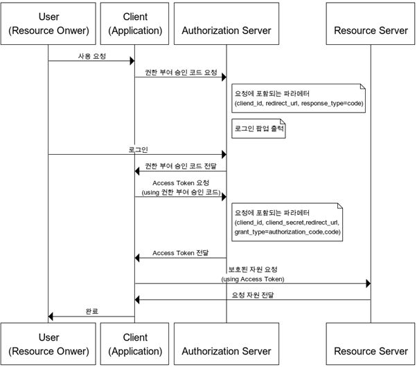
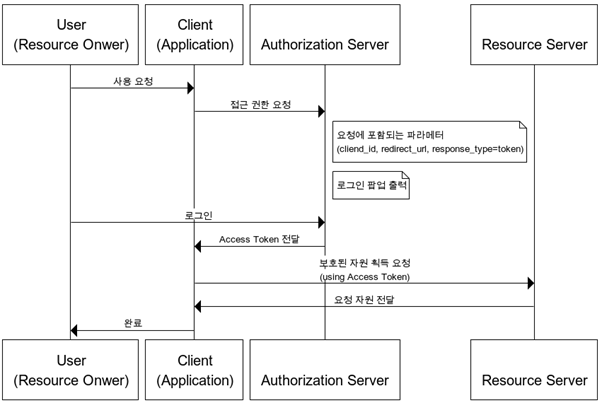
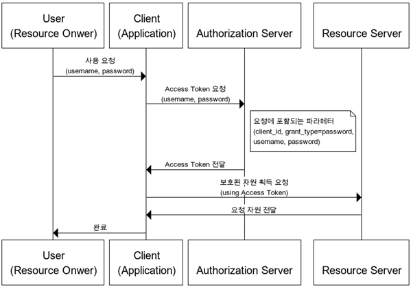

# OAuth 2.0 개념과 권한 부여 방식 알아보기

---

## OAuth 2.0 (Open Authorization 2.0)

웹 서핑을 하다보면 google, facebook등 외부 소셜 계정을 기반으로 간편하게 회원가입 및 로그인을 할 수 있는 방법을 쉽게 찾아볼 수 있다. 이러한 서비스들은 연동되는 외부 웹 어플리케이션에서 페이스북 및 트위터등이 제공하는 기능을 간편하게 사용할 수 있다는 장점이 있다.

구글, 페이스북, 트위터, 네이버 등등 다양한 플랫폼에서 특정한 사용자가 데이터에 접근하기 위해 제 3자의 클라이언트가 사용자의 접근 권한을 받을 수 있는 인증을 위한 **개방형 표준 프로토콜**이다.

---

### OAuth에서 역할

#### Resource Owner

**리소스의 소유자**로 본인의 정보에 접근할 수 있는 자격을 승인하는 주체다. 예시로 구글 로그인을 할 사용자를 말한다. Resource Owner은 인증하는 역할을 수행하고, 인증이 완료되면 동의를 통해 권한 획득 자격(Authorization Grant)을 클라이언트에게 부여한다.

#### Client

Resource Owner의 리소스를 사용하고자 접근 요청을 하는 **어플리케이션**이다.

#### Resource Server

Resource Owner의 정보가 저장된 서버입니다.

#### Authorization Server

권한 서버입니다. 인증과 인가를 수행하는 서버로 클라이언트의 접근 자격을 확인하고 AccessToken을 발급해 권한을 부여하는 역할을 수행합니다.

#### Access Token

자원에 대한 접근을 Resource Owner가 인가하였음을 나타내는 **자격 증명**

#### Refresh Token

AccessToken은 보안상 만료기간이 짧기 때문에 얼마 지나지 않아 만료되면 사용자는 로그인을 다시 시도해야한다. 그러나 RefreshToken을 사용하면 AccessToken을 다시 발급받아 로그인을 다시 할 필요가 없게끔 한다.

---

## 권한 부여 방식

OAuth2.0 프로토콜에서는 다양한 클라이언트 환경에 적합하도록 여러가지 권한 부여 방식에 따른 4가지 프로토콜을 제공합니다.

### 1. Authorization Code Grant | 권한 부여 승인 코드 방식

**가장 많이 쓰이고, 가장 기본이 되는 방식이다.**

사용자가 "구글로 로그인" 버튼을 누르면, 구글 로그인 화면이 뜬다. 사용자가 직접 구글에 로그인하면, 구글이 우리 앱에 "이 사람 맞아요"라는 **임시 코드(Authorization Code)**를 전달한다. 우리 앱은 이 코드를 다시 구글에 보내서 **Access Token으로 교환**한다. 이후 이 토큰으로 사용자 정보를 요청할 수 있게 된다.

핵심은 **사용자의 비밀번호를 우리 앱이 절대 직접 받지 않는다**는 점이다. 구글이 중간에서 인증을 대신 처리하고, 우리에겐 제한된 권한의 토큰만 넘겨주는 구조다.

토큰이 브라우저 URL에 직접 노출되지 않기 때문에 보안성이 높고, Refresh Token도 사용할 수 있다.

> **기술적 흐름 요약**
> 1. 클라이언트가 `response_type=code`로 권한 서버에 요청
> 2. 사용자가 로그인 페이지에서 로그인
> 3. 권한 서버가 `redirect_url`로 Authorization Code 전달
> 4. 클라이언트가 이 코드를 권한 서버 API에 보내 Access Token으로 교환

---

### 2. Implicit Grant | 암묵적 승인 방식

**중간 코드 없이 토큰을 바로 받는 간소화 버전이다.**

위의 Authorization Code 방식에서는 "임시 코드 → 토큰 교환"이라는 2단계를 거쳤다. Implicit 방식은 이 중간 단계를 생략하고, 사용자가 로그인하면 **Access Token을 바로 redirect_url로 전달**한다.

절차가 간단해서 빠르지만, 토큰이 URL에 그대로 노출되기 때문에 **보안이 취약하다.** 그래서 토큰 만료기간을 짧게 잡고, Refresh Token도 사용할 수 없다.

원래 자바스크립트 기반 브라우저 앱처럼 비밀 키(client_secret)를 안전하게 보관하기 어려운 환경을 위해 만들어졌지만, **요즘은 보안 문제 때문에 권장되지 않는 방식이다.** 대신 Authorization Code 방식에 PKCE를 결합하는 것이 현재 표준이다.

> **기술적 흐름 요약**
> 1. 클라이언트가 `response_type=token`으로 권한 서버에 요청
> 2. 사용자가 로그인 페이지에서 로그인
> 3. 권한 서버가 `redirect_url`로 Access Token을 바로 전달 (코드 교환 단계 없음)

---

### 3. Resource Owner Password Credentials Grant | 자원 소유자 자격증명 승인 방식

**사용자의 아이디와 비밀번호를 앱이 직접 받아서 토큰을 발급받는 방식이다.**

예를 들어 네이버가 자기네 공식 앱을 만들었다고 하자. 이 앱은 네이버가 직접 만든 것이니까, 사용자가 앱에 아이디/비밀번호를 입력하면 앱이 이를 네이버 서버에 전달해서 Access Token을 받아온다.

**이 방식은 권한 서버, 리소스 서버, 클라이언트가 모두 같은 시스템(같은 회사, 같은 서비스)에 속해 있을 때만 사용해야 한다.** 사용자의 비밀번호를 클라이언트가 직접 다루기 때문에, 외부 제3자 앱에서 이 방식을 쓰면 비밀번호가 유출될 위험이 있다. Refresh Token은 사용 가능하다.

> **기술적 흐름 요약**
> 1. 사용자가 클라이언트에 직접 username/password 입력
> 2. 클라이언트가 이를 권한 서버 API에 전달
> 3. 권한 서버가 Access Token 발급

---

### 4. Client Credentials Grant | 클라이언트 자격증명 승인 방식

**사용자가 아예 등장하지 않는 방식이다.**

위의 세 가지 방식은 모두 "사용자(사람)"가 로그인하는 과정이 있었다. 이 방식은 다르다. 앱(클라이언트) 자체가 자기 이름과 비밀 키(client_id + client_secret)만으로 토큰을 발급받는다.

예를 들어, 우리 백엔드 서버가 매일 새벽에 자동으로 외부 API에서 데이터를 가져와야 한다고 하자. 이때 사용자가 로그인할 필요 없이, 서버 자체의 자격증명만으로 토큰을 받아 데이터에 접근한다. **서버 간 통신(Server-to-Server)**에서 주로 사용된다.

자격증명을 안전하게 보관할 수 있는 서버 환경에서만 사용되며, Refresh Token은 사용할 수 없다 (어차피 필요할 때 바로 새 토큰을 발급받으면 되므로).

> **기술적 흐름 요약**
> 1. 클라이언트가 자신의 client_id와 client_secret으로 권한 서버에 직접 요청
> 2. 권한 서버가 Access Token 발급 (사용자 개입 없음)

---

### 한눈에 비교

| 방식 | 사용자 로그인 | 토큰 발급 과정 | Refresh Token | 주 사용처 |
|------|:---:|---|:---:|---|
| **Authorization Code** | O | 임시 코드 → 토큰 교환 | O | 일반적인 소셜 로그인 |
| **Implicit** | O | 토큰 바로 전달 | X | (현재 비권장) |
| **Password Credentials** | O | ID/PW로 직접 요청 | O | 자사 공식 앱 |
| **Client Credentials** | X | 앱 자격증명으로 직접 요청 | X | 서버 간 통신 |
